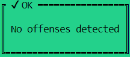
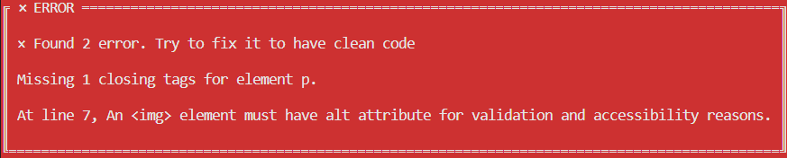
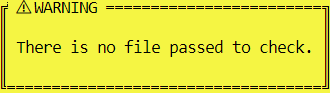
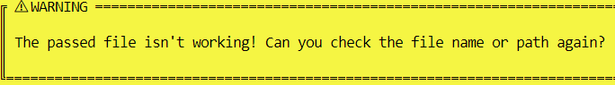

# Custom-HTML-Linter

> In this project, I built a custom HTML linter using Ruby to check if the code follows the best practices and warns the user if he/she does not follow them.

## Built With

- Ruby
- RSpec for TDD

## Getting Started

To get a local copy up and running follow these simple example steps.

### To clone this repo run this code on a terminal window: 

git clone https://github.com/Maha-Magdy/Build-Custom-Linter.git

### To have all gem files installed in your machine:

You must run bundle in your terminal.

### To run the TDD in your machine:

You must run rspec in your terminal.

## Basic Usage

# It's simple to get started:
* You have two option:

    * Pass a local HTML code into the workspace.html file by overriding what already exists, and run this command

    ```ruby
    ruby bin/main.rb workspace.html
    ```

    * Pass any local HTML file path/webpage path as an argument after ruby bin/main.rb, like this command.

    ```ruby
    ruby bin/main.rb file_path
    ```
# The expected result
* It may become one of these options.
    * No offenses detected if your code follows the best practices.
    

    * The number of detected errors that needed to fix.
    

    * Warnings if you do not pass file path/valid HTML file
    
\n
    

## Here are examples of the best practices which this custom HTML linter check

* Use proper document structure

~~~html
# Good Code

<!DOCTYPE html>
<html>
    <head>
        <title>proper title for the file</title>
    </head>
    <body>
        
        <p><span></span></p>
    </body>
</html>

# Bad Code

<html>
    <head>
        <title>proper title for the file</title>
    </head>

    
    <p><span></span></p>

</html>
~~~

* Declare the correct doctype

~~~html
# Good Code

<!DOCTYPE html>
~~~

* Always close tags

~~~html
# Good Code

<!DOCTYPE html>
    
    <div>
        <h1>Title</h1>
        <p>some text</p>
    </div>

# Bad Code

    <div>
        <h1>Title
        <p>some text
~~~

* Don't use inline styles

~~~html
# Good Code

    <h1>Title</h1>

# Bad Code

    <h1 style="padding: 15px">Title</h1>
~~~

* Use alt attribute with images

~~~html
# Good Code

    

# Bad Code

    
~~~

* Place external style sheets within the <head> tag

~~~html
# Good Code

    <html>
      <head>
        <link rel="stylesheet" href="">
      </head>
    </html>

# Bad Code

    <html>
      <body>
        <link rel="stylesheet" href="">
      </body>
    </html>
~~~

* Use lowercase markup for tags' name

~~~html
# Good Code

    <html>
      <head>
        <title>proper title for the file</title>
      </head>
      <body>
        
        <p><span></span></p>
      </body>
    </html>

# Bad Code

    <HTML>
      <HEAD>
        <title>proper title for the file</title>
      </HEAD>
      <BODY>
        
        <P><SPAN></SPAN></SPAN>
      </BODY>
    </HTML>
~~~

## Author

👤**Maha Magdy**

- GitHub: [Maha-Magdy](https://github.com/Maha-Magdy)
- Twitter: [@Maha_M_Abdelaal](https://twitter.com/Maha_M_Abdelaal)
- LinkedIn: [Maha Magdy](https://www.linkedin.com/in/maha-magdy-18a8a7116/)

## 🤝 Contributing

Contributions, issues, and feature requests are welcome!

Feel free to check the [issues page](https://github.com/Maha-Magdy/Build-Custom-Linter/issues).

## Show your support

Give a ⭐️ if you like this project!

## 📝 License

This project is [MIT](./LICENSE) licensed.
